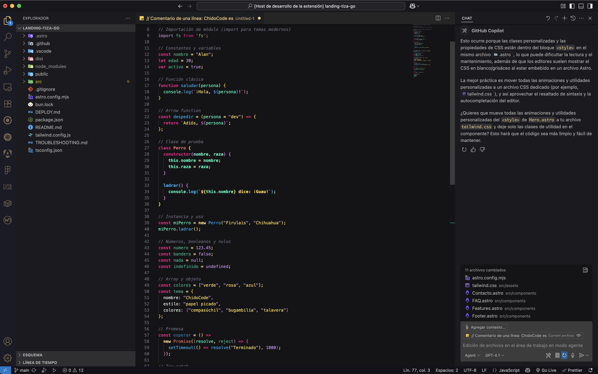
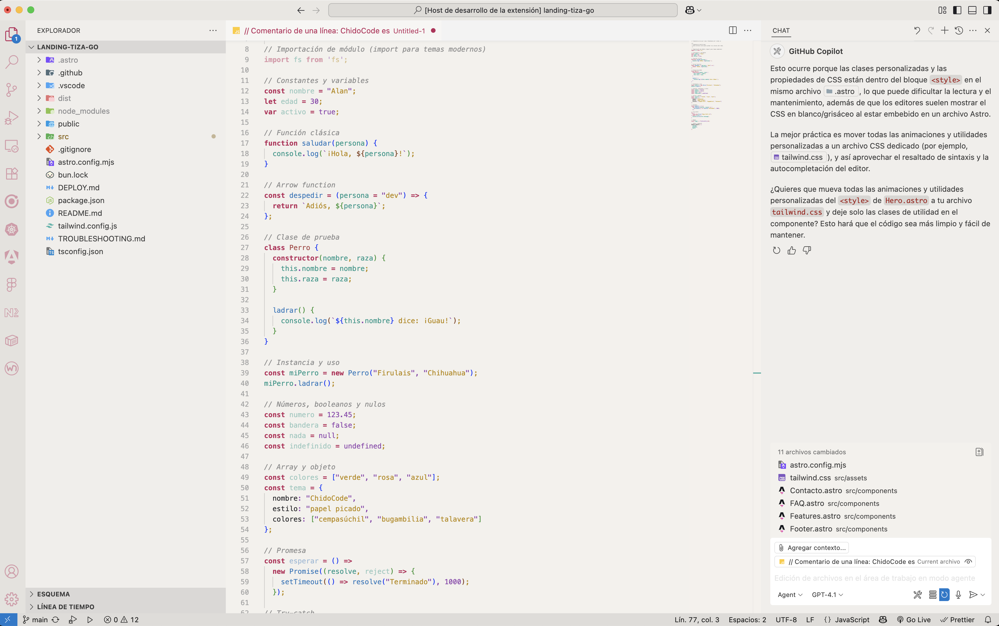
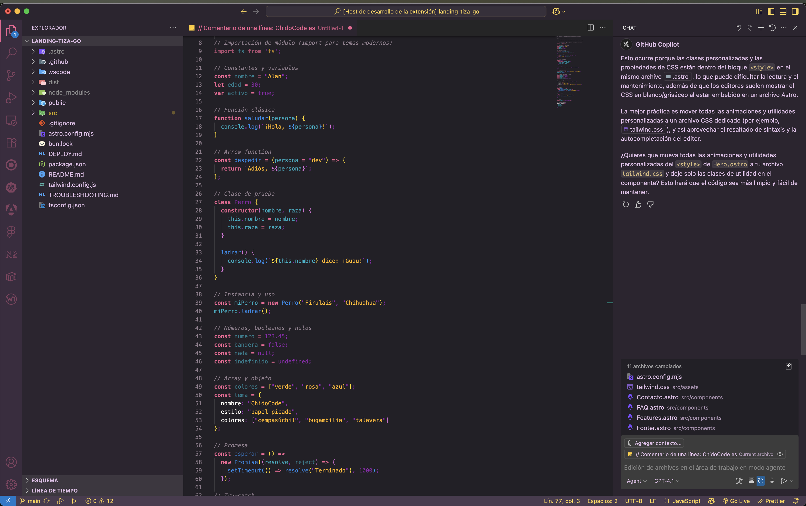
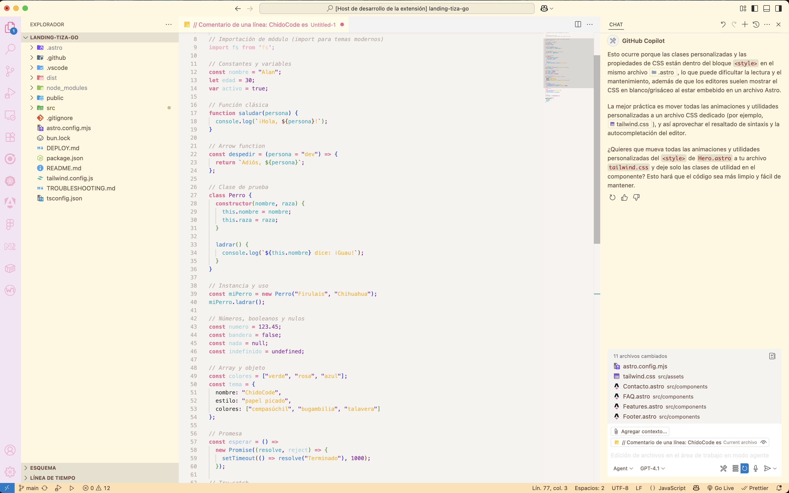

# 🇲🇽 ChidoCode Themes

¡Bienvenido a **ChidoCode**! 🎉

> Temas de Visual Studio Code inspirados en el colorido y la alegría del papel picado y la cultura mexicana. Perfectos para programar con sabor, alegría y mucho estilo.

## Temas incluidos

- 🌑 **ChidoCode Theme Dark**
- ☀️ **ChidoCode Theme Light**
- 🎊 **ChidoCode Theme Papel Picado**
- 🌙 **ChidoCode Theme Papel Picado Dark**

## Vista previa

| Dark | Light |
|------|-------|
|  |  |
|  |  |

## ¿Por qué ChidoCode?

- Colores vivos y alegres, pero suaves para no cansar la vista.
- Inspiración en el arte popular mexicano: papel picado, cempasúchil, bugambilias, talavera y más.
- Soporte para la mayoría de los lenguajes y sintaxis.
- ¡Ideal para quienes quieren que su editor se vea tan chido como su código!

## Instalación

1. Abre la paleta de comandos (`Ctrl+Shift+P` o `Cmd+Shift+P`).
2. Escribe `Preferencias: Color Theme` y selecciona tu tema ChidoCode favorito.
3. ¡Listo! A programar con alegría 🇲🇽

## Créditos y agradecimientos

- Inspirado en la cultura, colores y tradiciones de México.
- Hecho con 💚, café y mucha creatividad.

---

¡Que tu código sea tan colorido y alegre como el papel picado! 🎨🪅
